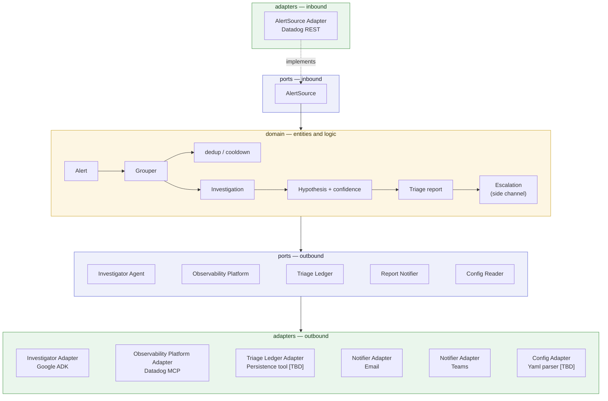

# Alert Triage

Teams receive Datadog alerts and ignore them — not because the alerts are
wrong, but because responding takes time and troubleshooting knowledge nobody
has in the moment. Alert Triage is a recurring job that watches for recent
alerts, does the first-pass investigation a knowledgeable human would do, and
sends the team a triage report.

It does the legwork and presents a hypothesis with its confidence. It does not
auto-remediate and does not decide for you: the question left to a human is
"act on this?" rather than "where do I even start?"

The full product vision, capability roadmap, and configuration model live in
[`docs/vision.md`](docs/vision.md).

> **Status:** scaffolding. The structure, the architecture boundary, and the
> quality gate are in place; the capability slices that ingest alerts and
> investigate them land on top of it.

## Setup

**Prerequisites**

- [uv](https://docs.astral.sh/uv/getting-started/installation/) — manages the
  Python version and the virtual environment, so no prior Python setup is
  needed.
- git with symlink support. macOS and Linux have it by default; on Windows use
  WSL, or clone with `git clone -c core.symlinks=true`.

**Install**

```bash
git clone https://github.com/EduardoFLima/alert-triage.git
cd alert-triage
uv sync
```

`uv sync` reads the committed `uv.lock`, so the versions you get are the
versions CI gets.

**Verify**

```bash
uv run pytest
```

A passing run means the environment is working, the package installed
correctly, and the architecture boundary holds.

**Configure**

Two kinds of setting, and which kind a value is decides where it goes.

*Behavior* — what the system watches and how it triages — lives in an optional
`config.yaml`, and every key there can also be set as an environment variable
by mapping its `section.key` path to `SECTION_KEY`. When both are set, the
environment wins.

```yaml
scope:
  owner: sre              # mandatory: whose alerts are triaged. No default.
grouping:
  window_seconds: 1800    # alerts of one service this close are one incident
ingestion:
  lookback_seconds: 3600  # how far back a run looks for alerts
```

Set `scope.owner` to the team that owns the alerts you want triaged; the
Datadog adapter spends it as a `team:` term in its event query. Keep
`ingestion.lookback_seconds` comfortably wider than the interval the job runs
on, so a delayed run does not step over alerts.

*Connection* — where the platform is and how to authenticate — is read from
the environment only, never from `config.yaml`, under Datadog's own variable
names:

```bash
export DD_API_KEY=...      # required
export DD_APP_KEY=...      # required; the Events API needs both
export DD_SITE=datadoghq.eu  # optional, defaults to datadoghq.com
```

Writing a site or a credential into `config.yaml` has no effect — it is not
used to reach the platform, and resolution proceeds as if the key were absent.
That is the rule for any new setting too: if it changes when the same triage
behavior is pointed at a different account or region, it is a connection
setting and belongs in the environment. Otherwise it is behavior and belongs
in the file. It keeps a config file portable across deployments, and keeps
anything credential-shaped out of a file that gets committed.

## Development

The four commands below are exactly what CI runs — nothing more, nothing
CI-only:

```bash
uv run ruff check src tests      # lint
uv run ruff format --check src tests
uv run mypy                      # strict type checking
uv run pytest                    # full suite, with coverage
```

Useful selections while working:

```bash
uv run pytest -m unit            # fast set: no network, no external service
uv run pytest -m integration     # integration-scope tests only
uv run ruff format src tests     # apply formatting
```

Engineering practices — TDD, clean code, the import rule — are in
[`AGENTS.md`](AGENTS.md), which applies to humans and coding agents alike.

## Architecture

Hexagonal (ports and adapters). The domain does not know which observability
tool, which agent framework, or which notification channel it is talking to —
those are adapters behind ports. That is what makes the tool forkable for your
own tooling, and what lets it run locally, in a container, or on Cloud Run
without the core changing.



Dependencies point inward only — `adapters` → `ports` → `domain` — and that
direction is enforced by `tests/unit/test_architecture.py`, not by review. The
composition root (`app/`) wires adapters into ports at startup; it has no
runtime dependency edge of its own.

```
src/alert_triage/
├── domain/      entities and logic; standard library only
├── ports/       interfaces; imports domain only
├── adapters/    one subpackage per integration, each owning its vendor library
│   ├── datadog/
│   ├── adk/
│   ├── email/
│   └── teams/
└── app/         composition root: the only layer that names concrete adapters

tests/
├── unit/        no network, no external service
└── integration/ fakes and real I/O
```

## Adding an adapter

Plugging in your own observability or notification tooling is a first-class
operation. Say you want to notify Slack instead of Teams:

**1. Pick the port you are implementing.** Each port is one seam:

| Port | Implement it to change… |
|---|---|
| `AlertSource` | where alerts come from (Datadog, Prometheus, …) |
| `Investigator` | how an alert group gets investigated |
| `ObservabilityPlatform` | where the investigator queries logs, traces, and metrics for context (Datadog, …) |
| `TriageLedger` | where dedup and cooldown state is kept |
| `Notifier` | where the triage report is delivered |
| `Config` | where configuration is read from |

**2. Create the subpackage.** One directory per integration, named for the
vendor: `src/alert_triage/adapters/slack/`. Your vendor library is a
dependency of that package and of nowhere else — add it to `[project]
dependencies` in `pyproject.toml`, and add it to the `forbidden_modules` list
of the vendor contract in the same file so it can never leak into the core.

**3. Implement the port.** Translate at the boundary: the adapter converts
between the vendor's payloads and the project's own domain types. If you find
yourself wanting to import your SDK from `ports/` or `domain/`, the
architecture test will stop you — that pull is the signal that a domain type
is missing, not that the rule is inconvenient.

**4. Write the tests it must carry.**

- A unit test per translation and per error path, against a fake or stubbed
  client — no network. These are the tests that must exist.
- An integration test in `tests/integration/` if the adapter has wiring worth
  exercising against a running fake.
- No new architecture test: the contracts already cover your subpackage.

**5. Wire it up in `app/`.** The composition root is the only place that names
your adapter. Nothing else in the codebase learns it exists.

**6. Run the gate.** `uv run ruff check src tests && uv run mypy && uv run
pytest`. Green means your adapter is in without having bent the architecture.

## License

See [LICENSE](LICENSE).
