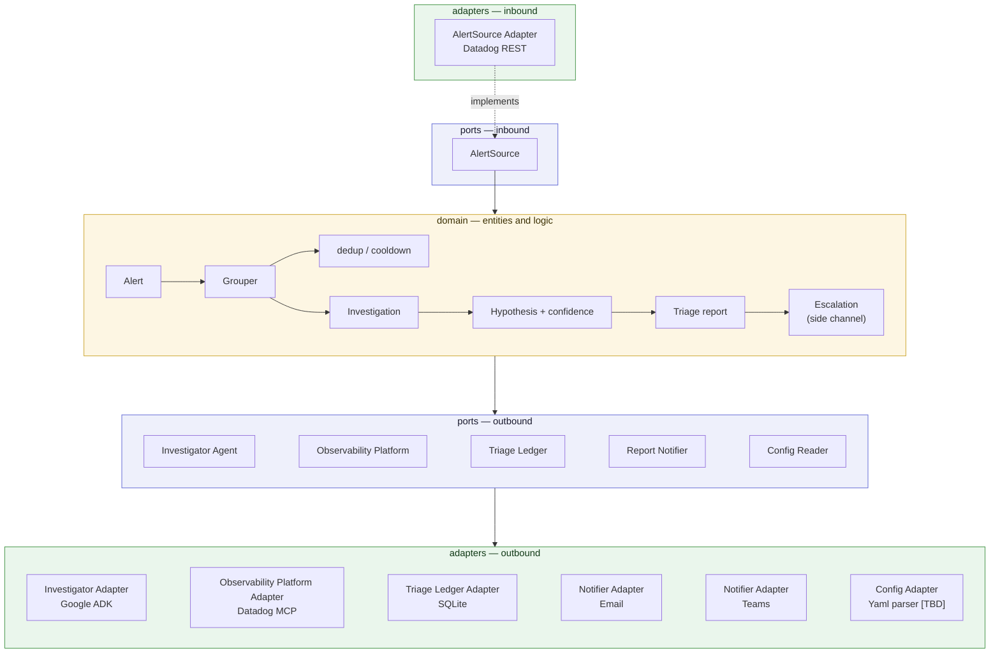

# Alert Triage

Teams receive Datadog alerts and ignore them — not because the alerts are
wrong, but because responding takes time and troubleshooting knowledge nobody
has in the moment. Alert Triage is a recurring job that watches for recent
alerts, does the first-pass investigation a knowledgeable human would do, and
sends the team a triage report.

It does the legwork and presents a hypothesis with its confidence. It does not
auto-remediate and does not decide for you: the question left to a human is
"act on this?" rather than "where do I even start?"

The full product vision and capability roadmap live in
[`docs/vision.md`](docs/vision.md); the settings reference is in
[`docs/configuration.md`](docs/configuration.md).

> **Status:** end to end, before investigation. A run fetches alerts, groups
> them, keeps a ledger so a team is told once per incident, and delivers a
> report — but the report is a pass-through of the alerts, and says so. The
> investigation that fills it in is the next capability slice.

## Setup

**Prerequisites**

- [uv](https://docs.astral.sh/uv/getting-started/installation/) — manages the
  Python version and the virtual environment, so no prior Python setup is
  needed.
- git with symlink support. macOS and Linux have it by default; on Windows use
  WSL, or clone with `git clone -c core.symlinks=true`.

**Install**

```bash
git clone https://github.com/EduardoFLima/alert-triage.git
cd alert-triage
uv sync
```

`uv sync` reads the committed `uv.lock`, so the versions you get are the
versions CI gets.

**Verify**

```bash
uv run pytest
```

A passing run means the environment is working, the package installed
correctly, and the architecture boundary holds.

**Configure**

`scope.owner` is the only mandatory behavior setting, and at least one
notification channel must be configured or the run refuses to start:

```bash
export SCOPE_OWNER=sre                                     # whose alerts are triaged
export ALERT_TRIAGE_TEAMS_WEBHOOK_URL=https://prod-1...    # where reports go
export DD_API_KEY=...                                      # and DD_APP_KEY
```

That is enough for a first run. Everything else has a documented default.

Which kind a setting is decides where it goes: *behavior* — what the system
watches and how it triages — lives in an optional `config.yaml`, while
*connection* — credentials, the ledger's location, where reports are sent — is
read from the environment only, so a config file stays portable and never grows
a key shaped like a credential.

The full reference — every key, every variable, the defaults, and how delivery
behaves when one channel fails — is in
[`docs/configuration.md`](docs/configuration.md).

## Running it

A run is one pass — fetch the recent alerts, group them, decide what each
group belongs to, report what is due, record what it handled — and then the
process exits. There is no daemon and no loop: something else decides how
often a run happens.

```bash
uv run alert-triage      # from a checkout
alert-triage             # wherever the package is installed
python -m alert_triage   # the same job, without the console script
```

A run reads everything it needs from its environment:

- `SCOPE_OWNER` — whose alerts are in scope. Mandatory, and the one setting
  that may instead live in `config.yaml`.
- `DD_API_KEY` and `DD_APP_KEY` — the Datadog credentials the fetch
  authenticates with. `DD_SITE` if the account is not on `datadoghq.com`.
- At least one notification channel, or the run refuses to start rather than
  fetching alerts it could tell nobody about.
- `ALERT_TRIAGE_LEDGER_PATH` — where the incidents on record are kept.
  Defaults to `alert_triage.db` in the working directory, which is why a
  deployment should set it explicitly.

The run's account of itself goes to stderr; what it did goes in its exit
status, which is what a scheduler acts on:

- `0` — every group the run fetched was decided, reported if it was due, and
  recorded. A run that had nothing to report succeeds having delivered
  nothing.
- `1` — the deployment is unusable, the fetch failed, or at least one group
  could not be reported or recorded. The log names the stage that failed and
  the service it was handling; the groups that succeeded still got their
  reports.

## Development

The four commands below are exactly what CI runs — nothing more, nothing
CI-only:

```bash
uv run ruff check src tests      # lint
uv run ruff format --check src tests
uv run mypy                      # strict type checking
uv run pytest                    # full suite, with coverage
```

Useful selections while working:

```bash
uv run pytest -m unit            # fast set: no network, no external service
uv run pytest -m integration     # integration-scope tests only
uv run ruff format src tests     # apply formatting
```

Engineering practices — TDD, clean code, the import rule — are in
[`AGENTS.md`](AGENTS.md), which applies to humans and coding agents alike.

## Architecture

Hexagonal (ports and adapters). The domain does not know which observability
tool, which agent framework, or which notification channel it is talking to —
those are adapters behind ports. That is what makes the tool forkable for your
own tooling, and what lets it run locally, in a container, or on Cloud Run
without the core changing.



Dependencies point inward only — `adapters` → `ports` → `domain` — and that
direction is enforced by `tests/unit/test_architecture.py`, not by review. The
composition root (`app/`) wires adapters into ports at startup; it has no
runtime dependency edge of its own.

```
src/alert_triage/
├── domain/      entities and logic; standard library only
├── ports/       interfaces; imports domain only
├── adapters/    one subpackage per integration, each owning its vendor library
│   ├── datadog/
│   ├── sqlite_ledger/
│   ├── adk/
│   ├── email/
│   ├── teams/
│   └── fan_out/ one Notifier standing for every configured channel
└── app/         composition root: the only layer that names concrete adapters

tests/
├── unit/        no network, no external service
└── integration/ fakes and real I/O
```

## Adding an adapter

Plugging in your own observability or notification tooling is a first-class
operation: pick the port you are implementing, create a subpackage owning your
vendor library, translate at the boundary, and wire it up in `app/`. The
step-by-step guide — including the extra conventions a notification channel
follows — is in [`docs/adapters.md`](docs/adapters.md).

## License

See [LICENSE](LICENSE).
