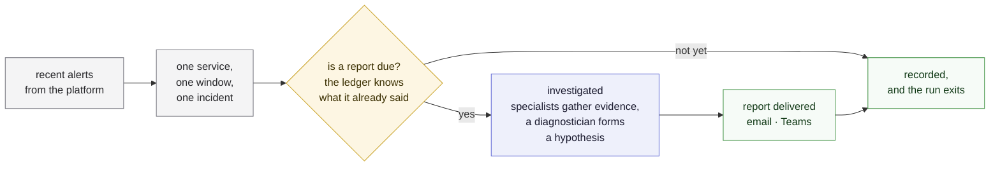
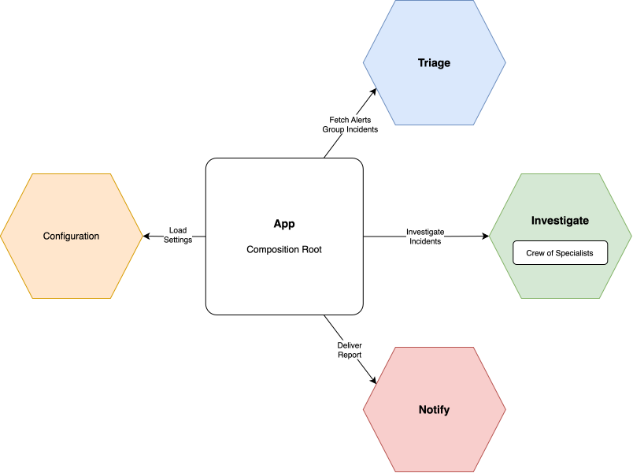

# Alert Triage

Teams receive Datadog alerts and ignore them — not because the alerts are
wrong, but because responding takes time and troubleshooting knowledge nobody
has in the moment. Alert Triage is a recurring job that watches for recent
alerts, does the first-pass investigation a knowledgeable human would do, and
sends the team a triage report.

It does the legwork and presents a hypothesis with its confidence. It does not
auto-remediate and does not decide for you: the question left to a human is
"act on this?" rather than "where do I even start?"

One alert's way through a run:



The full product vision and capability roadmap live in
[`docs/vision.md`](docs/vision.md); the settings reference is in
[`docs/configuration.md`](docs/configuration.md).

> **Status:** end to end, and it concludes. A report carries a hypothesis, how
> much confidence it has in it, and the evidence beneath; a diagnostician
> decides which signals each incident needs rather than paying for all of them.
> What is not yet measured is how good any of that is — the evaluation harness
> is the next capability slice.

## Getting started

### Setup

**Prerequisites**

- [uv](https://docs.astral.sh/uv/getting-started/installation/) — manages the
  Python version and the virtual environment, so no prior Python setup is
  needed.
- git with symlink support. macOS and Linux have it by default; on Windows use
  WSL, or clone with `git clone -c core.symlinks=true`.

**Install**

```bash
git clone https://github.com/EduardoFLima/alert-triage.git
cd alert-triage
uv sync
```

`uv sync` reads the committed `uv.lock`, so the versions you get are the
versions CI gets.

**Verify**

```bash
uv run pytest
```

A passing run means the environment is working, the package installed
correctly, and the architecture boundary holds.

**Configure**

`scope` is the only mandatory behavior setting — an owner, a set of services,
or both — and at least one notification channel must be configured or the run
refuses to start:

```bash
export SCOPE_OWNER=sre                                     # whose alerts are triaged
export SCOPE_SERVICES=checkout,payments                    # and/or which services'
export ALERT_TRIAGE_TEAMS_WEBHOOK_URL=https://prod-1...    # where reports go
export DD_API_KEY=...                                      # and DD_APP_KEY
```

Setting both narrows to the named services *of* that owner. Either one alone is
enough.

That is enough for a first run. Everything else has a documented default.

Prefer not to install anything? [Running it in a container](#in-a-container)
needs only a container runtime — no checkout, no uv, no Python.

Every setting is one of two kinds, and the kind decides where it goes:

- **Behavior** — what is watched and how it is triaged — in an optional
  `config.yaml`.
- **Connection** — credentials, where the ledger lives, where reports are sent
  — in the environment, or in a `.env` file beside the run.

Each kind ships an annotated example, `config.example.yaml` and `.env.example`,
to copy rather than start blank. Every key, every variable, the defaults, and
how delivery behaves when one channel fails are in
[`docs/configuration.md`](docs/configuration.md).

### Running it

A run is one pass — fetch the recent alerts, group them, decide what each
group belongs to, report what is due, record what it handled — and then the
process exits. There is no daemon and no loop: something else decides how
often a run happens.

```bash
uv run alert-triage      # from a checkout
alert-triage             # wherever the package is installed
python -m alert_triage   # the same job, without the console script
```

A run reads what it needs from its environment:

- **Scope** (`SCOPE_OWNER`, `SCOPE_SERVICES`) — whose alerts, and which
  services'. At least one is mandatory.
- **Datadog credentials** (`DD_API_KEY`, `DD_APP_KEY`) — what the fetch
  authenticates with.
- **A model credential** (`GOOGLE_API_KEY`) — what an investigation reasons on.
- **At least one notification channel** — or the run refuses to start, rather
  than fetching alerts it could tell nobody about.
- **The ledger's location** (`ALERT_TRIAGE_LEDGER_PATH`) and **how much it says
  out loud** (`LOG_LEVEL`) — both optional, both with defaults.

The account of a run goes to stderr, written for a human reading a terminal:
each phase of a run is boxed, and every consultation, tool call and thing an
agent said is captioned beneath the phase it belongs to. What reaches the log,
what is held back, and how to get the held part are in
[`docs/logging.md`](docs/logging.md).

What a run did goes in its exit status, which is what a scheduler acts on:

- `0` — every group the run fetched was decided, reported if it was due, and
  recorded. A run that had nothing to report succeeds having delivered
  nothing.
- `1` — the deployment is unusable, the fetch failed, or at least one group
  could not be reported or recorded. The log names the stage that failed and
  the service it was handling; the groups that succeeded still got their
  reports.

#### In a container

The same run, on any machine with a container runtime and no checkout. The image
performs one complete run when started with no arguments, so whatever starts it
needs to know nothing but its name.

```bash
docker build -t alert-triage .

docker run --rm \
  --env-file .env \
  -v alert-triage-ledger:/var/lib/alert-triage \
  alert-triage
```

Nothing follows the image name, because the image *is* the run: everything it
needs is handed to it from outside, so one image serves every deployment.

**Mount something durable at `/var/lib/alert-triage`.** Without it the run keeps
no incident history — dedup, continuation and the re-notify cooldown all stop
working, and every run opens every incident afresh and reports it again — while
still exiting `0`. Nothing warns you.

The rest — every flag, the `config.yaml` and enterprise-credential mounts,
bind-mount ownership, and `compose.yaml` for repeat runs — is in
[`docs/containerized.md`](docs/containerized.md).

## Development

The four commands below are exactly what CI runs — nothing more, nothing
CI-only:

```bash
uv run ruff check src tests      # lint
uv run ruff format --check src tests
uv run mypy                      # strict type checking
uv run pytest                    # full suite, with coverage
```

CI also builds the image, as its own step ahead of the tests. No fifth command
is needed locally.

Useful selections while working:

```bash
uv run pytest -m unit            # fast set: no network, no external service
uv run pytest -m integration     # integration-scope tests only
uv run pytest --no-cov           # skip coverage; the tightest red/green loop
uv run pytest -x --lf            # stop at the first failure, then retry just it
uv run pytest -rs                # say which tests skipped, and why
uv run ruff check --fix src tests   # apply the fixable lint
uv run ruff format src tests        # apply formatting
uv run lint-imports                 # the architecture contracts, on their own
```

Narrow further by path or by name — a file, a single test, or every test whose
name matches:

```bash
uv run pytest tests/unit/triage/domain/test_what_a_report_says.py
uv run pytest tests/unit/triage/domain/test_incident.py::test_an_incident_that_has_never_been_reported_says_so
uv run pytest -k "link or address"
```

Seven tests are gated on real credentials and skip without them, which is why
a fresh clone and CI stay green — they cover what no fake can answer, like
whether a URL this project composes is a route the platform actually accepts.
How to run them, and how to point them at an existing `.env`, is in
[`docs/live-testing.md`](docs/live-testing.md).

Engineering practices — TDD, clean code, the import rule — are in
[`AGENTS.md`](AGENTS.md), which applies to humans and coding agents alike.

## Architecture

Four bounded contexts, each a hexagon of its own:

- **triage** — the core. It owns the incident, groups the alerts, and decides
  what is owed about it. The customer of the other two.
- **investigation** — supporting. A target goes in; a hypothesis and the
  evidence beneath it come out.
- **notification** — supporting. A report goes in, and is delivered.
- **configuration** — not a peer of the three but what they all run on.

Alongside them, `shared/` holds the vocabulary more than one context speaks and
depends on no context, which is what stops it becoming a dumping ground.



Each supporting context is reached only through the contract it publishes, and
everything behind that contract is private.

Inside each context the domain does not know which agent framework or which
notification channel it is talking to — those are adapters behind ports. That
is what makes the tool forkable for your own tooling, and what lets it run
locally, in a container, or on Cloud Run without the core changing.

The observability platform is the exception: there is no port over it, because
MCP is already one — a specialist reaches the platform's MCP tools from inside
the investigator adapter, and the reasoning is in
[`docs/vision.md`](docs/vision.md#evidence-and-the-platform-boundary).

Each context drawn with the adapters that answer its ports is in
[`docs/architecture.md`](docs/architecture.md).

Dependencies point inward only — `adapters` → `ports` → `domain` — inside every
context, and a context never reaches past another's contract. Both rules are
enforced by `tests/unit/test_architecture.py`, not by review. The composition
root (`app/`) wires adapters into ports at startup; it is the only place
concrete adapters are named.

```
src/alert_triage/
├── shared/         vocabulary more than one context speaks; depends on nothing
│                  (a window, and how a run writes itself down)
├── configuration/  the settings a deployment behaves by, and where they are read
├── triage/         the core: incidents, grouping, policy, what a report says
│   ├── domain/     entities and logic; standard library only
│   ├── ports/      interfaces; imports domain only
│   └── adapters/   datadog (alerts) · sqlite (ledger)
├── investigation/  contract.py, and everything private behind it
│   ├── domain/     what a specialist is; what may be cited; what an account shows
│   ├── ports/      Investigator: the one question this context answers
│   └── adapters/   crew (specialists · reasoners · roster) · adk (the
│                   framework) · datadog (one provider's plumbing)
├── notification/   contract.py, the Notifier port, and the channels
│   └── adapters/   email · teams · fan-out over every configured channel
└── app/            composition root: the only place adapters are named,
                   plus how much of a run reaches the log

tests/
├── unit/        no network, no external service
└── integration/ fakes and real I/O
```

Both scope directories mirror the package tree above, so a module's tests are
found by the module's own path.

## Extending it

Two kinds of extension, and they have different shapes:

- **A port to implement.** Most of it — a notification channel under
  `notification/adapters/`, the triage ledger or an alert source under
  `triage/adapters/`.
- **A specialist to declare.** Observability tooling: one value under
  `investigation/adapters/crew/specialists/`, naming the tools it may reach and
  the provider serving each group of them, plus the instruction that uses them.
  A single specialist is a complete contribution. A provider nothing has
  reached yet is a directory under `investigation/adapters/` beside `datadog/`,
  holding how its MCP server is reached and how its items are addressed.

Both guides are in [`docs/adapters.md`](docs/adapters.md).

## License

See [LICENSE](LICENSE).
