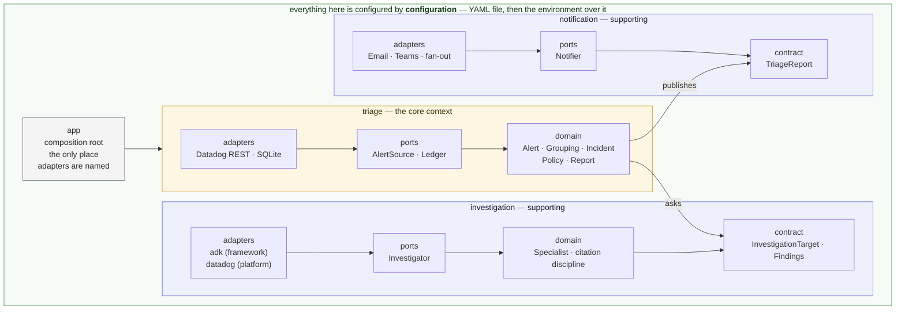

# Alert Triage

Teams receive Datadog alerts and ignore them — not because the alerts are
wrong, but because responding takes time and troubleshooting knowledge nobody
has in the moment. Alert Triage is a recurring job that watches for recent
alerts, does the first-pass investigation a knowledgeable human would do, and
sends the team a triage report.

It does the legwork and presents a hypothesis with its confidence. It does not
auto-remediate and does not decide for you: the question left to a human is
"act on this?" rather than "where do I even start?"

The full product vision and capability roadmap live in
[`docs/vision.md`](docs/vision.md); the settings reference is in
[`docs/configuration.md`](docs/configuration.md).

> **Status:** end to end, before investigation. A run fetches alerts, groups
> them, keeps a ledger so a team is told once per incident, and delivers a
> report — but the report is a pass-through of the alerts, and says so. The
> investigation that fills it in is the next capability slice.

## Setup

**Prerequisites**

- [uv](https://docs.astral.sh/uv/getting-started/installation/) — manages the
  Python version and the virtual environment, so no prior Python setup is
  needed.
- git with symlink support. macOS and Linux have it by default; on Windows use
  WSL, or clone with `git clone -c core.symlinks=true`.

**Install**

```bash
git clone https://github.com/EduardoFLima/alert-triage.git
cd alert-triage
uv sync
```

`uv sync` reads the committed `uv.lock`, so the versions you get are the
versions CI gets.

**Verify**

```bash
uv run pytest
```

A passing run means the environment is working, the package installed
correctly, and the architecture boundary holds.

**Configure**

`scope.owner` is the only mandatory behavior setting, and at least one
notification channel must be configured or the run refuses to start:

```bash
export SCOPE_OWNER=sre                                     # whose alerts are triaged
export ALERT_TRIAGE_TEAMS_WEBHOOK_URL=https://prod-1...    # where reports go
export DD_API_KEY=...                                      # and DD_APP_KEY
```

That is enough for a first run. Everything else has a documented default.

Rather than exporting by hand, copy the two annotated examples and edit them —
every key and every variable is listed there with its default:

```bash
cp config.example.yaml config.yaml   # behavior; safe to commit
cp .env.example .env                 # connection; gitignored, never committed
```

A `.env` file beside the run is read at startup and only *supplements* the
environment: anything the process already exported wins, so a container or a
scheduler is never overridden by a file lying next to it.

Which kind a setting is decides where it goes: *behavior* — what the system
watches and how it triages — lives in an optional `config.yaml`, while
*connection* — credentials, the ledger's location, where reports are sent — is
read from the environment only, so a config file stays portable and never grows
a key shaped like a credential.

The full reference — every key, every variable, the defaults, and how delivery
behaves when one channel fails — is in
[`docs/configuration.md`](docs/configuration.md).

## Running it

A run is one pass — fetch the recent alerts, group them, decide what each
group belongs to, report what is due, record what it handled — and then the
process exits. There is no daemon and no loop: something else decides how
often a run happens.

```bash
uv run alert-triage      # from a checkout
alert-triage             # wherever the package is installed
python -m alert_triage   # the same job, without the console script
```

A run reads everything it needs from its environment:

- `SCOPE_OWNER` — whose alerts are in scope. Mandatory, and the one setting
  that may instead live in `config.yaml`.
- `DD_API_KEY` and `DD_APP_KEY` — the Datadog credentials the fetch
  authenticates with. `DD_SITE` if the account is not on `datadoghq.com`, and
  `DD_WEB_SUBDOMAIN` if its web app is not served from `app`.
- `GOOGLE_API_KEY` — what the model an investigation reasons on costs to
  reach. A deployment on the enterprise platform sets
  `GOOGLE_GENAI_USE_ENTERPRISE=true` instead and needs no key.
- At least one notification channel, or the run refuses to start rather than
  fetching alerts it could tell nobody about.
- `ALERT_TRIAGE_LEDGER_PATH` — where the incidents on record are kept.
  Defaults to `data/alert_triage.db` under the working directory, which is why a
  deployment should set it explicitly.

The run's account of itself goes to stderr; what it did goes in its exit
status, which is what a scheduler acts on:

- `0` — every group the run fetched was decided, reported if it was due, and
  recorded. A run that had nothing to report succeeds having delivered
  nothing.
- `1` — the deployment is unusable, the fetch failed, or at least one group
  could not be reported or recorded. The log names the stage that failed and
  the service it was handling; the groups that succeeded still got their
  reports.

## Development

The four commands below are exactly what CI runs — nothing more, nothing
CI-only:

```bash
uv run ruff check src tests      # lint
uv run ruff format --check src tests
uv run mypy                      # strict type checking
uv run pytest                    # full suite, with coverage
```

Useful selections while working:

```bash
uv run pytest -m unit            # fast set: no network, no external service
uv run pytest -m integration     # integration-scope tests only
uv run pytest --no-cov           # skip coverage; the tightest red/green loop
uv run pytest -x --lf            # stop at the first failure, then retry just it
uv run pytest -rs                # say which tests skipped, and why
uv run ruff check --fix src tests   # apply the fixable lint
uv run ruff format src tests        # apply formatting
uv run lint-imports                 # the architecture contracts, on their own
```

Scope markers come from the directory a test lives in, never from a decorator,
so `-m unit` and `-m integration` need nothing kept in sync by hand.

Narrow further by path or by name — a file, a single test, or every test whose
name matches:

```bash
uv run pytest tests/unit/triage/domain/test_what_a_report_says.py
uv run pytest tests/unit/triage/domain/test_incident.py::test_an_incident_that_has_never_been_reported_says_so
uv run pytest -k "link or address"
```

### Against a real Datadog account

Seven tests are gated on real credentials and skip without them, which is why
a fresh clone and CI stay green. They exist for the three things no fake can
answer: that the tool names in a specialist's declaration exist on Datadog's
MCP server, that a real model given the instruction actually calls them, and
that a URL this project composes is a route the platform accepts rather than a
404.

```bash
export DD_API_KEY=... DD_APP_KEY=... GOOGLE_API_KEY=...
uv run pytest tests/integration/investigation/adapters/datadog \
              tests/integration/triage/adapters/datadog -rs
```

The credentials must reach the **process environment**: the skip is decided as
the module loads, and nothing in the test path reads `.env` on the way in.
`-rs` is what tells you they ran rather than skipped past.

**Using the `.env` you already have.** Rather than exporting by hand, let `uv`
put the file into the environment for the run:

```bash
uv run --env-file .env pytest tests/integration/investigation/adapters/datadog \
                              tests/integration/triage/adapters/datadog -rs
```

It parses the file the way the application does and applies it to that one
command only, so nothing leaks into the shell afterwards. Anything already
exported still wins, which matches how a `.env` behaves at runtime. For a
shell that is not going through `uv`, or to keep the values for a whole
session:

```bash
set -a; source .env; set +a     # every assignment exported until the shell exits
```

`source` is the blunter of the two — it is the shell reading the file, not a
dotenv parser, so an unquoted value containing spaces or a `#` mid-line will
not survive it intact. Prefer `--env-file` unless you want the values to
persist.

Loading `.env` is deliberately not automatic. A stray file in a checkout would
otherwise start reaching a real account and spending model calls during an
ordinary `uv run pytest`, and the gate reading the process environment is what
keeps that an explicit act.

Two of the seven are the link checks, and they are worth running alone after
touching anything that builds a URL — they follow the address and rule out the
404 that a route built from the wrong kind of identifier returns:

```bash
uv run pytest -k opens_rather_than_404s -rs
```

`ALERT_TRIAGE_LIVE_SERVICE` names a service in the account under test,
defaulting to `checkout`. A quiet service is a valid answer: these confirm the
retrieval happened, not that it found anything.

A run costs a model call and a handful of platform calls. Note that `-k live`
also catches the email and Teams channel tests, which are "live" in a different
sense — a real server in this process, no account and no credentials — and
those run every time.

Engineering practices — TDD, clean code, the import rule — are in
[`AGENTS.md`](AGENTS.md), which applies to humans and coding agents alike.

## Architecture

Four bounded contexts, each a hexagon of its own. **Triage** is the core: it
owns the incident, decides what is owed about it, and is the customer of the
other two. **Investigation** and **notification** are supporting contexts, each
reached only through the contract it publishes — a target goes into one and
findings come out; a report goes into the other and is delivered.
**Configuration** is not a peer of the three: it is what they all run on, which
is why the diagram draws it around them rather than beside them.

Inside each context the domain does not know which agent framework or which
notification channel it is talking to — those are adapters behind ports. That
is what makes the tool forkable for your own tooling, and what lets it run
locally, in a container, or on Cloud Run without the core changing.

The observability platform is the exception: there is no port over it, because
MCP is already one — a specialist reaches the platform's MCP tools from inside
the investigator adapter, and the reasoning is in
[`docs/vision.md`](docs/vision.md#evidence-and-the-platform-boundary).



Dependencies point inward only — `adapters` → `ports` → `domain` — inside every
context, and a context never reaches past another's contract. Both rules are
enforced by `tests/unit/test_architecture.py`, not by review. The composition
root (`app/`) wires adapters into ports at startup; it is the only place
concrete adapters are named.

```
src/alert_triage/
├── shared/         vocabulary more than one context speaks; depends on nothing
├── configuration/  the settings a deployment behaves by, and where they are read
├── triage/         the core: incidents, grouping, policy, what a report says
│   ├── domain/     entities and logic; standard library only
│   ├── ports/      interfaces; imports domain only
│   └── adapters/   datadog (alerts) · sqlite (ledger)
├── investigation/  contract.py, and everything private behind it
│   ├── domain/     what a specialist is; what may be cited
│   ├── ports/      Investigator: the one question this context answers
│   └── adapters/   adk (the framework) · datadog (the platform)
├── notification/   contract.py, the Notifier port, and the channels
│   └── adapters/   email · teams · fan-out over every configured channel
└── app/            composition root: the only place adapters are named

tests/
├── unit/        no network, no external service
└── integration/ fakes and real I/O
```

Both scope directories mirror the package tree above, so a module's tests are
found by the module's own path.

## Extending it

Two kinds of extension, and they have different shapes. **Most of it is a port
to implement** — a notification channel under `notification/adapters/`, the
triage ledger or an alert source under `triage/adapters/`. **Observability
tooling is a platform to add** — a directory under
`investigation/adapters/`, holding how its MCP server is reached and the
specialists declared against it. A specialist is one value: the platform's
tools and the instruction that uses them, and a single one is a complete
contribution. Both guides are in [`docs/adapters.md`](docs/adapters.md).

## License

See [LICENSE](LICENSE).
