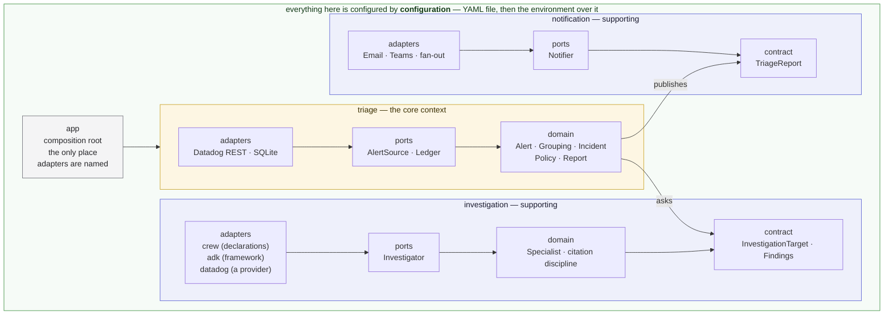

# Alert Triage

Teams receive Datadog alerts and ignore them — not because the alerts are
wrong, but because responding takes time and troubleshooting knowledge nobody
has in the moment. Alert Triage is a recurring job that watches for recent
alerts, does the first-pass investigation a knowledgeable human would do, and
sends the team a triage report.

It does the legwork and presents a hypothesis with its confidence. It does not
auto-remediate and does not decide for you: the question left to a human is
"act on this?" rather than "where do I even start?"

The full product vision and capability roadmap live in
[`docs/vision.md`](docs/vision.md); the settings reference is in
[`docs/configuration.md`](docs/configuration.md).

> **Status:** end to end, and it concludes. A run fetches alerts, groups them,
> keeps a ledger so a team is told once per incident, investigates, and delivers
> a report carrying a hypothesis, how much confidence it has in it, and the
> evidence beneath. A diagnostician decides which signals each incident needs
> rather than paying for all of them. What is not yet measured is how good any
> of that is — the evaluation harness is the next capability slice.

## Setup

**Prerequisites**

- [uv](https://docs.astral.sh/uv/getting-started/installation/) — manages the
  Python version and the virtual environment, so no prior Python setup is
  needed.
- git with symlink support. macOS and Linux have it by default; on Windows use
  WSL, or clone with `git clone -c core.symlinks=true`.

**Install**

```bash
git clone https://github.com/EduardoFLima/alert-triage.git
cd alert-triage
uv sync
```

`uv sync` reads the committed `uv.lock`, so the versions you get are the
versions CI gets.

**Verify**

```bash
uv run pytest
```

A passing run means the environment is working, the package installed
correctly, and the architecture boundary holds.

**Configure**

`scope.owner` is the only mandatory behavior setting, and at least one
notification channel must be configured or the run refuses to start:

```bash
export SCOPE_OWNER=sre                                     # whose alerts are triaged
export ALERT_TRIAGE_TEAMS_WEBHOOK_URL=https://prod-1...    # where reports go
export DD_API_KEY=...                                      # and DD_APP_KEY
```

That is enough for a first run. Everything else has a documented default.

Prefer not to install anything? [Running it in a container](#in-a-container)
needs only a container runtime — no checkout, no uv, no Python.

Rather than exporting by hand, copy the two annotated examples and edit them —
every key and every variable is listed there with its default:

```bash
cp config.example.yaml config.yaml   # behavior; safe to commit
cp .env.example .env                 # connection; gitignored, never committed
```

A `.env` file beside the run is read at startup and only *supplements* the
environment: anything the process already exported wins, so a container or a
scheduler is never overridden by a file lying next to it.

Which kind a setting is decides where it goes: *behavior* — what the system
watches and how it triages — lives in an optional `config.yaml`, while
*connection* — credentials, the ledger's location, where reports are sent — is
read from the environment only, so a config file stays portable and never grows
a key shaped like a credential.

The full reference — every key, every variable, the defaults, and how delivery
behaves when one channel fails — is in
[`docs/configuration.md`](docs/configuration.md).

## Running it

A run is one pass — fetch the recent alerts, group them, decide what each
group belongs to, report what is due, record what it handled — and then the
process exits. There is no daemon and no loop: something else decides how
often a run happens.

```bash
uv run alert-triage      # from a checkout
alert-triage             # wherever the package is installed
python -m alert_triage   # the same job, without the console script
```

A run reads everything it needs from its environment:

- `SCOPE_OWNER` — whose alerts are in scope. Mandatory, and the one setting
  that may instead live in `config.yaml`.
- `DD_API_KEY` and `DD_APP_KEY` — the Datadog credentials the fetch
  authenticates with. `DD_SITE` if the account is not on `datadoghq.com`, and
  `DD_WEB_SUBDOMAIN` if its web app is not served from `app`.
- `GOOGLE_API_KEY` — what the model an investigation reasons on costs to
  reach. A deployment on the enterprise platform sets
  `GOOGLE_GENAI_USE_ENTERPRISE=true` instead and needs no key.
- At least one notification channel, or the run refuses to start rather than
  fetching alerts it could tell nobody about.
- `ALERT_TRIAGE_LEDGER_PATH` — where the incidents on record are kept.
  Defaults to `data/alert_triage.db` under the working directory, which is why a
  deployment should set it explicitly.
- `LOG_LEVEL` — how much the run says out loud. Optional, and `INFO` by
  default.

### In a container

The same run, on any machine with a container runtime and no checkout. The
image performs one complete run when started with no arguments, so whatever
starts it needs to know nothing but its name.

```bash
docker build -t alert-triage .

docker run --rm \
  --env-file .env \
  -v alert-triage-ledger:/var/lib/alert-triage \
  -v ./config.yaml:/app/config.yaml:ro \
  -v ~/.config/gcloud/application_default_credentials.json:/var/secrets/google/application_default_credentials.json:ro \
  -e GOOGLE_APPLICATION_CREDENTIALS=/var/secrets/google/application_default_credentials.json \
  alert-triage
```

Nothing follows the image name, because the image *is* the run. Everything it
needs is handed to it from outside — the image carries no credentials and no
`config.yaml`, so one image serves every deployment.

| Part | What it does | Leaving it out |
| --- | --- | --- |
| `--rm` | Deletes the container once the run exits. A run is one pass, not a service. | Every run leaves a stopped container behind. Nothing is lost: the history is on the volume, not in the container. |
| `--env-file .env` | Connection settings — the Datadog and model credentials, and where reports go. Docker sets them as real process variables before the run starts. | Pass them one at a time instead: `-e SCOPE_OWNER=sre -e DD_API_KEY=... -e DD_APP_KEY=... -e GOOGLE_API_KEY=... -e ALERT_TRIAGE_TEAMS_WEBHOOK_URL=...`. With neither, the run refuses to start rather than fetch alerts it could tell nobody about. |
| `-v alert-triage-ledger:/var/lib/alert-triage` | The incident history, kept where the container cannot take it away. Docker creates the named volume the first time it is used. | The run keeps no history, and still exits `0`. This is the one that bites — see below. |
| `-v ./config.yaml:/app/config.yaml:ro` | Behaviour — what is watched and how it is triaged. `/app` is the image's working directory, which is where the run looks for the file. `:ro` mounts it read-only, because config is input and nothing in the run should be able to write it back. | Every key falls back to its documented default, which is fine as long as `scope.owner` reaches the run some other way. |
| `-v …/application_default_credentials.json` and `-e GOOGLE_APPLICATION_CREDENTIALS` | **Only with `GOOGLE_GENAI_USE_ENTERPRISE=true`**, which reaches the model through the enterprise platform instead of an API key, using what `gcloud auth application-default login` wrote. Set `GOOGLE_CLOUD_PROJECT` and `GOOGLE_CLOUD_LOCATION` with it — a container has no `gcloud` to discover them from. `:ro` because these are your own credentials: right for your machine, not for a scheduled deployment. | Set `GOOGLE_API_KEY` in `.env` instead — the simpler path, and what the image assumes. Without the enterprise flag the key is required and this mount is ignored. |

**The volume is not optional in practice.** A container's filesystem does not
survive it, so a run without that mount keeps no incident history: dedup,
continuation, and the two-day re-notify cooldown all stop working, and every
run opens every incident afresh and reports it again — while still exiting `0`.
Nothing warns you. The image keeps the ledger at `/var/lib/alert-triage/`;
mount something durable there.

A named volume is the easy answer, because it is initialised with the image's
own ownership and so asks nothing of the host. Swap it for a bind mount —
`-v ./data:/var/lib/alert-triage` — to carry on from the history a local run
already built: the image keeps the ledger under the same filename a checkout
uses, so the two share one file rather than opening one each. The cost is
ownership. The run is an unprivileged user (UID 10001), and on Linux the host
directory must be owned by it, which `sudo chown -R 10001:10001 data` settles.
Docker Desktop on macOS and Windows ignores ownership, so a bind mount that
works there can still fail on a Linux host.

**For a repeat local run, use `compose.yaml`.** It writes the mount and the
`.env` down once, so the second run reaches the first run's ledger without
anyone retyping them:

```bash
docker compose run --rm triage
```

It mounts no `config.yaml`, because it cannot do so safely: `env_file` takes
`required: false` and a bind mount has no equivalent, so naming a file that a
fresh clone does not have makes Docker create a *directory* in its place and
mount that over the path the run reads. Put the mount in a
`compose.override.yaml` instead, which compose merges when it is there and
ignores when it is not:

```yaml
services:
  triage:
    volumes:
      - ./config.yaml:/app/config.yaml:ro
      - ~/.config/gcloud/application_default_credentials.json:/var/secrets/google/application_default_credentials.json:ro
    environment:
      GOOGLE_APPLICATION_CREDENTIALS: /var/secrets/google/application_default_credentials.json
```

The leading `./` is not optional. A source with no `/` in it is read as the
name of a volume rather than as a path, and compose refuses the project with
`service "triage" refers to undefined volume config.yaml`. A `~` is expanded.

That file is gitignored, like `config.yaml` and `.env`, because which settings
a machine runs with is that machine's business. For a one-off, pass the mount
on the command line instead: `docker compose run --rm -v ./config.yaml:/app/config.yaml:ro triage`.

The account of a run goes to stderr, written for a human reading a terminal:
each phase of a run is boxed, and every consultation, tool call and thing an
agent said is captioned beneath the phase it belongs to. What reaches the log,
what is held back, and how to get the held part are in
[`docs/logging.md`](docs/logging.md).

What a run did goes in its exit status, which is what a scheduler acts on:

- `0` — every group the run fetched was decided, reported if it was due, and
  recorded. A run that had nothing to report succeeds having delivered
  nothing.
- `1` — the deployment is unusable, the fetch failed, or at least one group
  could not be reported or recorded. The log names the stage that failed and
  the service it was handling; the groups that succeeded still got their
  reports.

## Development

The four commands below are exactly what CI runs — nothing more, nothing
CI-only:

```bash
uv run ruff check src tests      # lint
uv run ruff format --check src tests
uv run mypy                      # strict type checking
uv run pytest                    # full suite, with coverage
```

CI builds the image as its own step ahead of the tests, so that a Dockerfile
which stops building fails as a build rather than as a puzzling test error.
You do not need a fifth command to match it: the tests that exercise the image
build one on demand when nothing has named one already, and skip — saying so
under `-rs` — where no container runtime is available, which is why a checkout
without Docker still runs green.

Useful selections while working:

```bash
uv run pytest -m unit            # fast set: no network, no external service
uv run pytest -m integration     # integration-scope tests only
uv run pytest --no-cov           # skip coverage; the tightest red/green loop
uv run pytest -x --lf            # stop at the first failure, then retry just it
uv run pytest -rs                # say which tests skipped, and why
uv run ruff check --fix src tests   # apply the fixable lint
uv run ruff format src tests        # apply formatting
uv run lint-imports                 # the architecture contracts, on their own
```

Scope markers come from the directory a test lives in, never from a decorator,
so `-m unit` and `-m integration` need nothing kept in sync by hand.

Narrow further by path or by name — a file, a single test, or every test whose
name matches:

```bash
uv run pytest tests/unit/triage/domain/test_what_a_report_says.py
uv run pytest tests/unit/triage/domain/test_incident.py::test_an_incident_that_has_never_been_reported_says_so
uv run pytest -k "link or address"
```

Seven tests are gated on real credentials and skip without them, which is why
a fresh clone and CI stay green — they cover what no fake can answer, like
whether a URL this project composes is a route the platform actually accepts.
How to run them, and how to point them at an existing `.env`, is in
[`docs/live-testing.md`](docs/live-testing.md).

Engineering practices — TDD, clean code, the import rule — are in
[`AGENTS.md`](AGENTS.md), which applies to humans and coding agents alike.

## Architecture

Four bounded contexts, each a hexagon of its own. **Triage** is the core: it
owns the incident, decides what is owed about it, and is the customer of the
other two. **Investigation** and **notification** are supporting contexts, each
reached only through the contract it publishes — a target goes into one and a
diagnosis comes out; a report goes into the other and is delivered.
**Configuration** is not a peer of the three: it is what they all run on, which
is why the diagram draws it around them rather than beside them.

Inside each context the domain does not know which agent framework or which
notification channel it is talking to — those are adapters behind ports. That
is what makes the tool forkable for your own tooling, and what lets it run
locally, in a container, or on Cloud Run without the core changing.

The observability platform is the exception: there is no port over it, because
MCP is already one — a specialist reaches the platform's MCP tools from inside
the investigator adapter, and the reasoning is in
[`docs/vision.md`](docs/vision.md#evidence-and-the-platform-boundary).



Dependencies point inward only — `adapters` → `ports` → `domain` — inside every
context, and a context never reaches past another's contract. Both rules are
enforced by `tests/unit/test_architecture.py`, not by review. The composition
root (`app/`) wires adapters into ports at startup; it is the only place
concrete adapters are named.

```
src/alert_triage/
├── shared/         vocabulary more than one context speaks; depends on nothing
│                  (a window, and how a run writes itself down)
├── configuration/  the settings a deployment behaves by, and where they are read
├── triage/         the core: incidents, grouping, policy, what a report says
│   ├── domain/     entities and logic; standard library only
│   ├── ports/      interfaces; imports domain only
│   └── adapters/   datadog (alerts) · sqlite (ledger)
├── investigation/  contract.py, and everything private behind it
│   ├── domain/     what a specialist is; what may be cited; what an account shows
│   ├── ports/      Investigator: the one question this context answers
│   └── adapters/   crew (specialists · reasoners · roster) · adk (the
│                   framework) · datadog (one provider's plumbing)
├── notification/   contract.py, the Notifier port, and the channels
│   └── adapters/   email · teams · fan-out over every configured channel
└── app/            composition root: the only place adapters are named,
                   plus how much of a run reaches the log

tests/
├── unit/        no network, no external service
└── integration/ fakes and real I/O
```

Both scope directories mirror the package tree above, so a module's tests are
found by the module's own path.

## Extending it

Two kinds of extension, and they have different shapes. **Most of it is a port
to implement** — a notification channel under `notification/adapters/`, the
triage ledger or an alert source under `triage/adapters/`. **Observability
tooling is a specialist to declare** — one value under
`investigation/adapters/crew/specialists/`, naming the tools it may reach and
the provider serving each group of them, plus the instruction that uses them. A
single specialist is a complete contribution. A provider nothing has reached
yet is a directory under `investigation/adapters/` beside `datadog/`, holding
how its MCP server is reached and how its items are addressed. Both guides are
in [`docs/adapters.md`](docs/adapters.md).

## License

See [LICENSE](LICENSE).
