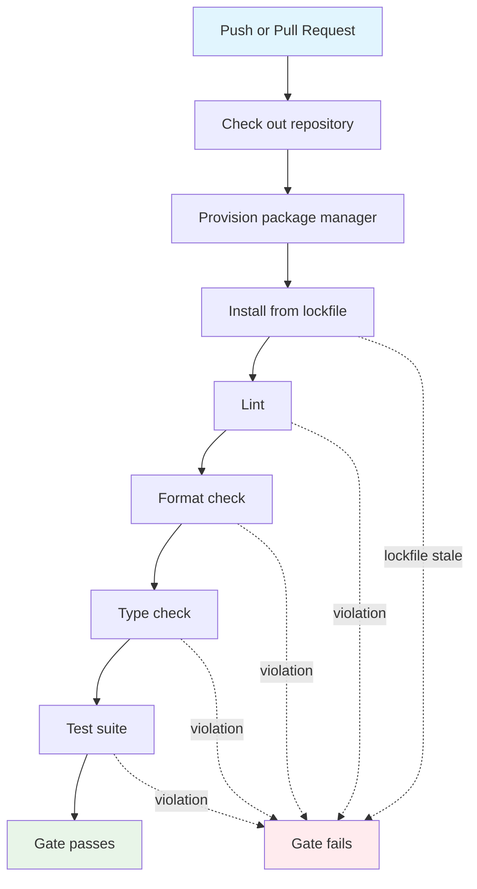

## Workflow Overview

**Purpose**: Prove that every proposed change passes the same lint, format, type,
and test checks a developer runs locally, before it reaches `main`.
**Trigger Events**: Push to any branch; pull request against any branch.
**Target Environments**: None — this workflow validates only. It builds no
artifact, publishes nothing, and touches no deployment target.

**Governing requirement**: "Quality gate runs on every change" in
`openspec/changes/add-scaffolding-conventions/specs/project-conventions/spec.md`.
**Governing decision**: "CI runs the same four commands as local development" in
that change's `design.md`.

## Execution Flow Diagram



## Jobs & Dependencies

| Job Name | Purpose | Dependencies | Execution Context |
|----------|---------|--------------|-------------------|
| gate | Run the full quality gate as one fail-fast sequence | None | Linux runner, symlink-preserving checkout |

Single job by design: the checks are cheap on an empty-to-small tree, and one job
keeps the branch protection surface to one required check. Splitting into
parallel jobs is a change to this specification, not an implementation detail.

## Requirements Matrix

### Functional Requirements

| ID | Requirement | Priority | Acceptance Criteria |
|----|-------------|----------|---------------------|
| REQ-001 | The gate runs on every push and every pull request, on all branches | High | A commit pushed to any branch produces a workflow run; opening a PR produces one |
| REQ-002 | The gate runs lint, format check, static type check, and the full test suite | High | Each check appears as a distinct, individually inspectable step |
| REQ-003 | Failure of any check fails the overall run | High | A run containing a failing check reports a non-success conclusion |
| REQ-004 | Failure output names the offending rule/expression/test | High | The failing step's log carries the tool's own diagnostic, unfiltered |
| REQ-005 | The gate is exactly the commands documented in the README, in the same order | High | The command list here and in `README.md` § Development match textually |
| REQ-006 | Dependencies install from the committed lockfile without resolution | High | Installation fails if the lockfile is out of date with `pyproject.toml` |
| REQ-007 | The architecture boundary check and the agent-instruction symlink check run inside the test suite, not as bespoke workflow steps | Medium | No workflow step names import-linter or symlinks directly |
| REQ-008 | The workflow requires no repository secret to run | High | A fork's PR run completes without secret access |

### Security Requirements

| ID | Requirement | Implementation Constraint |
|----|-------------|---------------------------|
| SEC-001 | Least-privilege token | Workflow-level token grants read access to repository contents only |
| SEC-002 | No credential persistence in the workspace | Checkout must not leave the token in `.git/config` for later steps to reuse |
| SEC-003 | No secrets consumed | The gate must not read repository or environment secrets; a check that needs one belongs in a separate workflow |
| SEC-004 | Third-party actions are version-referenced | Every external action is referenced by a released tag — a major alias where the publisher maintains one, otherwise an exact version. Never a branch ref; upgrades are deliberate edits |
| SEC-005 | Untrusted input is never interpolated into a shell step | Steps run fixed commands; no `${{ }}` expansion of PR-controlled text into `run:` |

### Performance Requirements

| ID | Metric | Target | Measurement Method |
|----|--------|--------|--------------------|
| PERF-001 | Wall-clock run time | < 3 min | Workflow run duration in the Actions UI |
| PERF-002 | Hard ceiling before abort | 10 min | Job timeout; a run hitting it is a defect, not a slow build |
| PERF-003 | Dependency install on a warm cache | < 15 s | Duration of the install step |
| PERF-004 | Redundant in-flight runs | 0 per pull request ref | Superseded PR runs are cancelled when a new commit arrives |

## Input/Output Contracts

### Inputs

```yaml
# Repository Triggers
push:
  branches: ["**"]          # every branch, so a scratch branch is verifiable
pull_request: {}            # all target branches
paths: []                   # no path filtering: the gate is cheap and total

# Repository state consumed
pyproject.toml   # tool config: ruff, mypy, pytest, coverage
.importlinter    # the architecture contracts, one file of their own
uv.lock          # pinned resolution; the install is frozen against it
.python-version  # interpreter version the package manager provisions
src/, tests/     # the code under inspection
AGENTS.md + symlinks  # asserted by a test, so checkout must preserve links
```

No workflow inputs, no environment variables, no `workflow_dispatch` parameters.

### Outputs

```yaml
# Job Outputs
conclusion: success | failure   # the branch-protection signal; the only output
```

The gate publishes no artifact. Coverage is reported to the step log by the test
run and is not uploaded, gated on, or exported.

### Secrets & Variables

| Type | Name | Purpose | Scope |
|------|------|---------|-------|
| — | — | None required (SEC-003) | — |

## Execution Constraints

### Runtime Constraints

- **Timeout**: 10 minutes per job.
- **Concurrency**: One in-flight run per workflow + ref. Pull-request runs are
  cancelled when superseded; branch pushes are not cancelled, so each pushed
  commit keeps its own verdict.
- **Resource Limits**: Standard hosted runner. No self-hosted or large runner.

### Environmental Constraints

- **Runner Requirements**: Linux. Required, not incidental — the test suite
  asserts that harness instruction files are symlinks, which a Windows runner
  does not reproduce without `core.symlinks=true`.
- **Network Access**: Outbound only, to the package index and the interpreter
  download, during installation. Test steps require none: unit tests are
  network-free by definition, and no integration test in this repo reaches a
  live service.
- **Permissions**: `contents: read`. No write access to contents, checks, PRs,
  packages, or the OIDC token.

## Error Handling Strategy

| Error Type | Response | Recovery Action |
|------------|----------|-----------------|
| Lint or format violation | Fail immediately; later steps do not run | Run the same command locally; `ruff format src tests` fixes formatting |
| Type error | Fail; mypy's diagnostic identifies file, line, and expression | Fix the type or add a narrowly scoped per-module override in `pyproject.toml` |
| Test failure | Fail; pytest output identifies the test and assertion | Reproduce locally with `uv run pytest` |
| Architecture boundary violation | Fail as a test failure, naming the module and the offending import | Remove the import, or move the code to the layer allowed to hold it |
| Symlink degraded to a copy | Fail as a test failure | Restore the link; do not commit a duplicated instruction file |
| Stale lockfile | Fail at the install step before any check runs | Re-lock and commit `uv.lock` alongside the `pyproject.toml` edit |
| Runner or network fault | Fail with a non-project error | Re-run the job; a repeat is an infrastructure issue, not a change defect |

Fail-fast is intentional. It mirrors the `&&`-chained local command sequence and
keeps the first failure at the top of the log rather than buried among others.
The cost is that a run reports one failing category at a time.

## Quality Gates

### Gate Definitions

| Gate | Criteria | Bypass Conditions |
|------|----------|-------------------|
| Lint | Zero violations of the rule selection in `pyproject.toml` | None. Suppressions are per-line `noqa` in the source, reviewed like code |
| Formatting | Working tree is byte-identical to the formatter's output | None |
| Types | Clean under strict mode across `src` and `tests` | None. Exceptions are named per-module overrides in `pyproject.toml`, never a global relaxation |
| Tests | Every test passes, including architecture and symlink checks | None |
| Coverage | Reported, not enforced | N/A — no threshold is set while the tree is scaffolding |

There is no administrator bypass path defined by this specification. A change
that cannot pass the gate changes the gate's configuration in `pyproject.toml`,
visibly, in the same pull request.

## Monitoring & Observability

### Key Metrics

- **Success Rate**: ≥ 95% of runs on `main` succeed. A red `main` is treated as
  an incident, not a backlog item.
- **Execution Time**: See PERF-001.
- **Resource Usage**: Not monitored. The gate is well inside free-tier minutes
  for a single-job Linux run.

### Alerting

| Condition | Severity | Notification Target |
|-----------|----------|---------------------|
| Failure on a pull request | Informational | PR author, via the GitHub checks UI |
| Failure on `main` | High | Repository maintainers, via GitHub's default failure notification |
| Repeated infrastructure failure | Medium | Maintainers; no automated paging is configured |

## Integration Points

### External Systems

| System | Integration Type | Data Exchange | SLA Requirements |
|--------|------------------|---------------|------------------|
| Python package index | Dependency download | Wheels/sdists pinned by the lockfile | Best-effort; an outage fails the install step, not a check |
| Interpreter distribution | Toolchain download | CPython build matching `.python-version` | Best-effort |
| GitHub Actions cache | Read/write | Resolved dependency environment, keyed on the lockfile | Best-effort; a cache miss costs time only, never correctness |

### Dependent Workflows

| Workflow | Relationship | Trigger Mechanism |
|----------|--------------|-------------------|
| — | None today | — |

Future container build and deploy workflows (capability slice 14, see
`docs/vision.md`) are expected to depend on this gate's success rather than
re-run its checks.

## Compliance & Governance

### Audit Requirements

- **Execution Logs**: GitHub's default retention. No external log shipping.
- **Approval Gates**: None. The gate is automated and unconditional; human review
  happens in pull-request review, not in the workflow.
- **Change Control**: Edits to the workflow travel through a pull request and are
  themselves checked by the pre-change version of the workflow.

### Security Controls

- **Access Control**: Read-only workflow token (SEC-001).
- **Secret Management**: Not applicable — no secrets in scope (SEC-003).
- **Vulnerability Scanning**: Out of scope for this workflow. Dependency and code
  scanning, if adopted, belong in a separate workflow with its own specification.

## Edge Cases & Exceptions

### Scenario Matrix

| Scenario | Expected Behavior | Validation Method |
|----------|-------------------|-------------------|
| Pull request from a fork | Runs with a read-only token and no secrets; passes or fails on merit | Open a fork PR and observe the run |
| `pyproject.toml` edited without re-locking | Install step fails before any check runs | Edit a dependency constraint, do not re-lock, push |
| Instruction symlink committed as a regular file | Test suite fails at the symlink assertion | Replace the link with a copy on a scratch branch |
| Transitive boundary violation (`domain → domain.util → adapters`) | Test suite fails; the contract walks the transitive graph | Add the indirect import on a scratch branch |
| Documentation-only commit | Gate still runs and passes; no path filter excludes it | Push a README-only commit |
| Rapid successive pushes to a PR | Earlier in-flight run is cancelled; only the newest commit's verdict stands | Push twice within a run's duration |
| Empty test tree | Gate passes vacuously | Accepted; noted as a known limitation in the change's design |

## Validation Criteria

- **VLD-001**: The workflow's check commands match `README.md` § Development
  verbatim, in order. Divergence is a defect in whichever file drifted.
- **VLD-002**: A deliberate lint error on a scratch branch produces a failing run
  whose log names the ruff rule code and source location.
- **VLD-003**: A deliberate type error produces a failing run whose log names the
  offending expression.
- **VLD-004**: A deliberate boundary violation produces a failing run whose log
  names the importing module and the forbidden import.
- **VLD-005**: A clean branch produces a successful run.
- **VLD-006**: The workflow declares no `permissions` beyond `contents: read`.
- **VLD-007**: The workflow references no secret.
- **VLD-008**: `uv.lock` is respected: no run resolves dependencies afresh.

### Confirmed failure modes

VLD-002…VLD-005 are the criteria a local run cannot settle. They are claims
about what a *run* does rather than about what a command prints, so they are
established against the remote and the runs recorded here. Confirmed
2026-09-02 on the scratch branch `ci-gate-failure-modes`, since deleted; one
defect per push, because the gate is fail-fast and a second defect in the same
commit would never be reached.

| Criterion | Deliberate defect | Run | What the failing step named |
|-----------|-------------------|-----|------------------------------|
| VLD-002 | An unused `import os` in `triage/domain/alert.py` | [33605095906](https://github.com/EduardoFLima/alert-triage/actions/runs/33605095906) | **Lint**: ``F401 `os` imported but unused``, `--> src/alert_triage/triage/domain/alert.py:3:8`, with the offending line quoted. Format, types and tests never ran. |
| VLD-003 | `_DELIBERATE_TYPE_ERROR: int = "not an int"` | [33605210318](https://github.com/EduardoFLima/alert-triage/actions/runs/33605210318) | **Type check**: `alert.py:33: error: Incompatible types in assignment (expression has type "str", variable has type "int")  [assignment]`. Tests never ran. |
| VLD-004 | `triage/domain/alert.py` importing `investigation.domain.evidence` | [33605273573](https://github.com/EduardoFLima/alert-triage/actions/runs/33605273573) | **Test**: `Contexts do not reach past each other's contracts BROKEN`, then `alert_triage.triage.domain.alert -> alert_triage.investigation.domain.evidence (l.6)`. The other 919 tests passed, so the report is the whole failure. |
| VLD-005 | None — the defect removed and nothing else changed | [33605341178](https://github.com/EduardoFLima/alert-triage/actions/runs/33605341178) | Nothing. Every step passed, which is what makes the three red runs above evidence about the defects rather than about the branch. |

A fifth run is worth knowing about because it failed for the wrong reason. A
git worktree this repository hosts under `.claude/worktrees/` is staged by
`git add -A` as a gitlink with no `.gitmodules` entry, and `actions/checkout`
fails on it — `fatal: No url found for submodule path` — before any check runs,
so the log names nothing about the change that caused it. `.gitignore` now
excludes that directory.

### Performance Benchmarks

- **PERF-B01**: Cold-cache run completes within PERF-001's 3-minute target.
- **PERF-B02**: Warm-cache install completes within PERF-003's 15-second target.

## Change Management

### Update Process

1. **Specification Update**: Amend this document first; it is the contract.
2. **Review & Approval**: Pull-request review by a maintainer.
3. **Implementation**: Apply the change to `.github/workflows/ci.yml`.
4. **Testing**: Re-run the VLD-002…VLD-005 pair of negative and positive proofs
   on a scratch branch.
5. **Deployment**: Merge. The workflow is live on the next push.

Adding a check to the gate means adding the same command to `README.md`
§ Development and to `AGENTS.md`'s "Before you call a change done" list in the
same pull request. A CI-only check violates REQ-005.

### Version History

| Version | Date | Changes | Author |
|---------|------|---------|--------|
| 1.0 | 2026-08-04 | Initial specification | alert-triage maintainers |
| 1.1 | 2026-09-02 | Recorded the confirmed failure modes for VLD-002…VLD-005 | alert-triage maintainers |

## Related Specifications

- [`openspec/changes/add-scaffolding-conventions/specs/project-conventions/spec.md`](../openspec/changes/add-scaffolding-conventions/specs/project-conventions/spec.md)
  — the "Quality gate runs on every change" requirement this workflow satisfies
- [`openspec/changes/add-scaffolding-conventions/design.md`](../openspec/changes/add-scaffolding-conventions/design.md)
  — the decision that CI runs exactly the local commands
- [`docs/vision.md`](vision.md) — capability slice order: slice 13 confirmed
  this gate's failure modes, slice 14 the container/deployment work that will
  build on it
- [`AGENTS.md`](../AGENTS.md) — the local command list the gate mirrors
